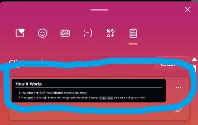
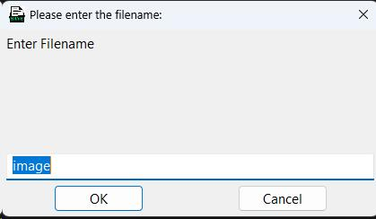

# Paste as Image

A simple script using `WinClipv2` libraries written in Autohotkey language, helping users paste snipped images as files in the explorer, similar to how it works in VSCode.

## How to Use

1. Run the script `.exe` (or `.ahk` if you have Autohotkey installed).
2. Use your snipping hotkey `Win+Shift+S`.
3. Press `Ctrl+V` at your desired destination.

## How It Works

1. The script checks if the **Clipboard** contains an image. The image script will not run if the clipboard is text format.

2. If an image is found, it saves the image with the default name `image.jpeg` or a name of your choice.

3. Press OK to save the image.

## Contribution

Contributions are welcome! Feel free to submit issues or pull requests to improve the script.